## PureOS - Hype and Reality

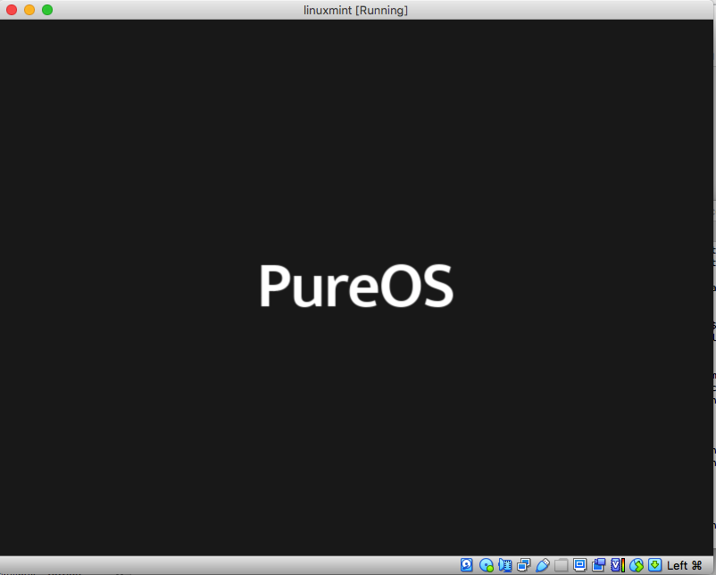

### Background

Last month I got a CD containing multiple distros and there I found PureOS. At first the name did not register but when I did some digging, I remembered that PureOS was the Linux OS developed by [Purism](https://puri.sm), the company behind Librem products where its laptop is [liked by Edward Snowden](https://www.geeky-gadgets.com/edward-snowdens-favorite-laptop-gets-unboxed-video-28-10-2019/). On further reading I read that PureOS will also power the [Librem 5 Phones](https://puri.sm/products/librem-5/). Which definitely is one of the most hyped Linux distributions out there. Rest of the blog is my quick review of PureOS.

## Introduction

My first stop for learning about PureOS was its [website](https://www.pureos.net/) and its [wikipedia](https://en.wikipedia.org/wiki/PureOS) page. From the initial reading it seemed to be: 

>PureOS is a GNU/Linux distribution focusing on privacy and security, using the GNOME desktop environment.
>Debian-based GNU/Linux distribution, merging open-source software packages from the Debian “testing” main archive using a rolling release model.
>The default web browser in PureOS is called PureBrowser, a variant of Firefox focusing on privacy. The default search engine in PureBrowser is DuckDuckGo.

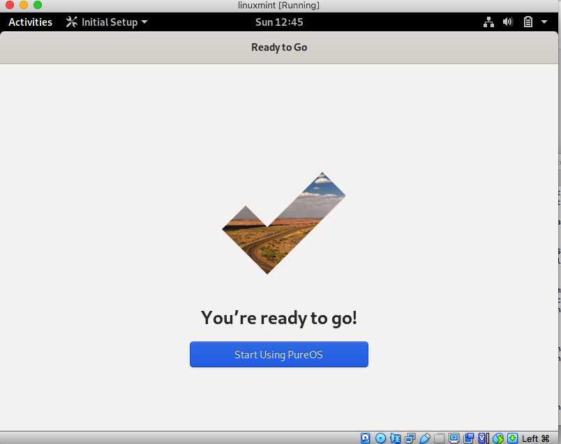

And while I did not explore more on its privacy aspect. I found all the above information consistent with the OS experience after my review. I used PureOS 9.0 gnome version ISO for the review. You can download the latest copy [here](https://www.pureos.net/download/).

## First Impressions

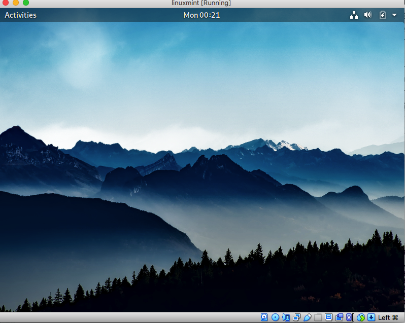

PureOS had more of the stock Gnome experience and still did not feel slow while using on by 4GB RAM VM and also the desktop look and feel felt minimal and yet modern. By now I have got used to the Activity tab and hence finding apps in gnome was easier now that I had experienced other Gnome based distributions. 

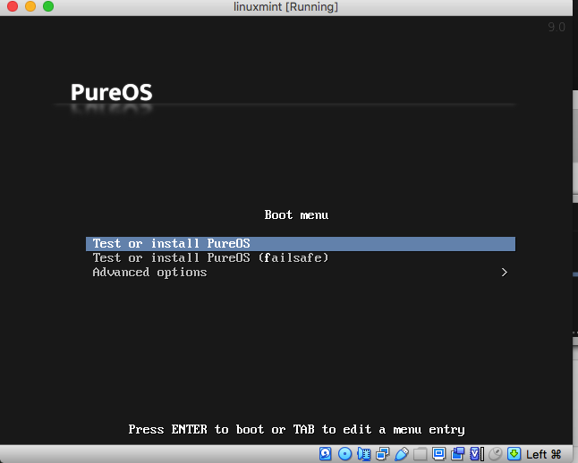

The boot process was simple and the flash PureOS logo was cool and felt modern. The initial setup of LiveCD was also easy. 

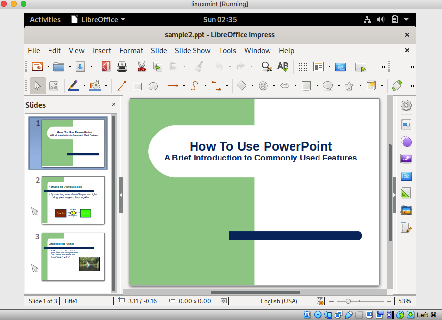

I also tried different types of file types, it supported most of the file formats and came with LibreOffice for excels, presentations and documents which is an important part of anyone's daily use. 

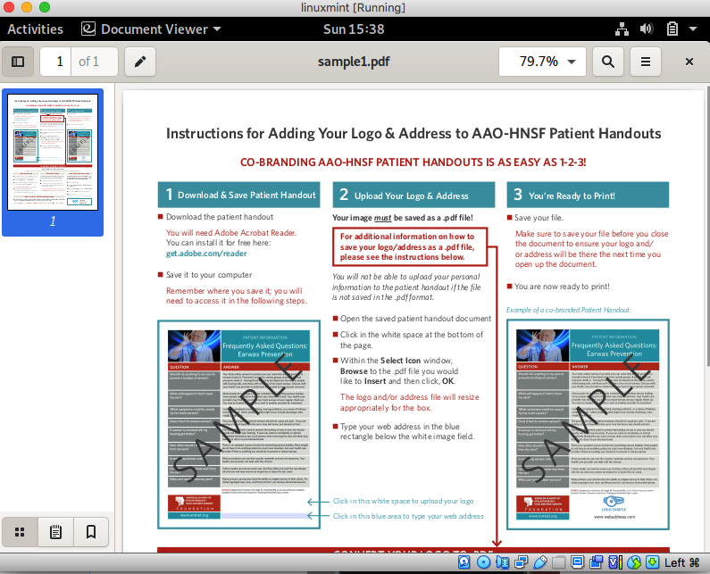

## Positives

The good part for me using PureOS was it was more familiar to me as a Linux user and using the apt package manager was also good. PureOS may not be for first time linux users but for people who want a pure Gnome experience. 

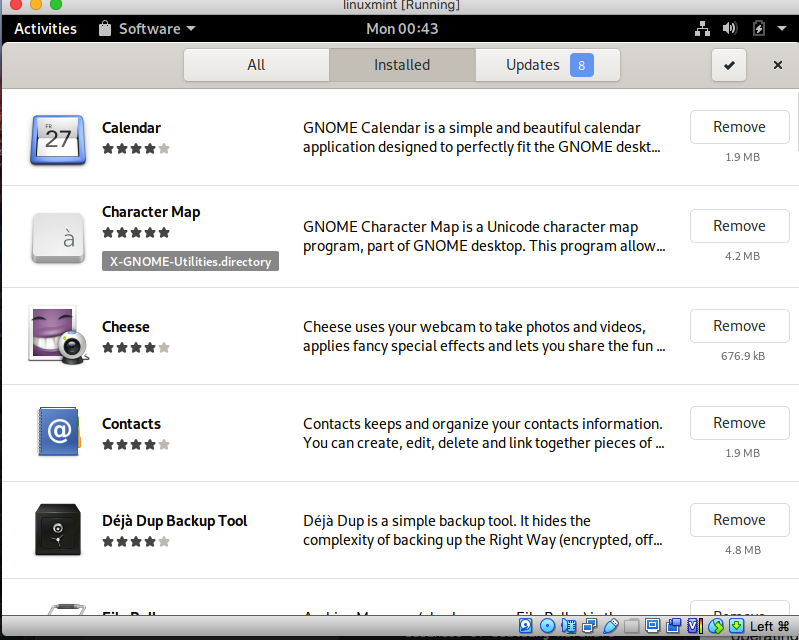

For me it was a mixed bag where it was rough around edges in some areas, some of its apps were very helpful. 

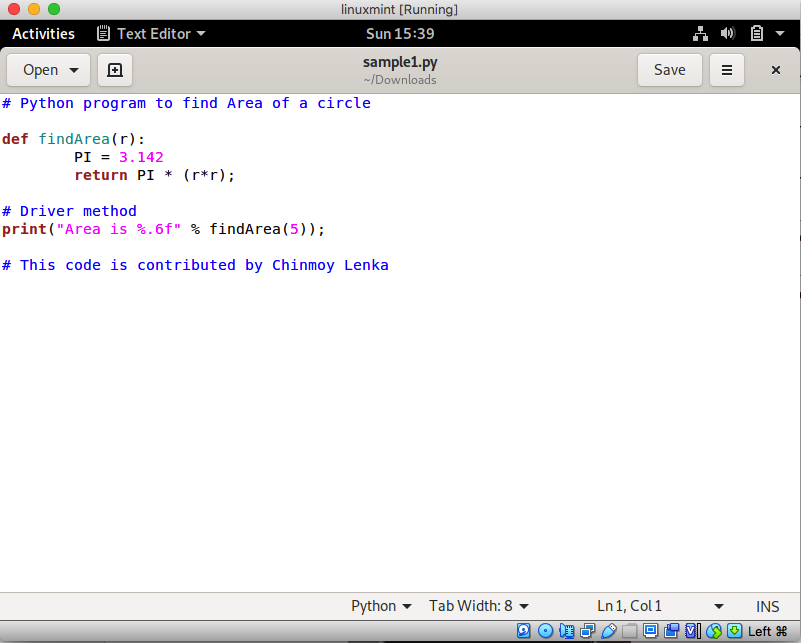

As a developer I liked its native support for .py files as I presume it provides Gedit as the stock editor hence making code changes and running a quick program easy. Another stand out feature for me was the terminal. 

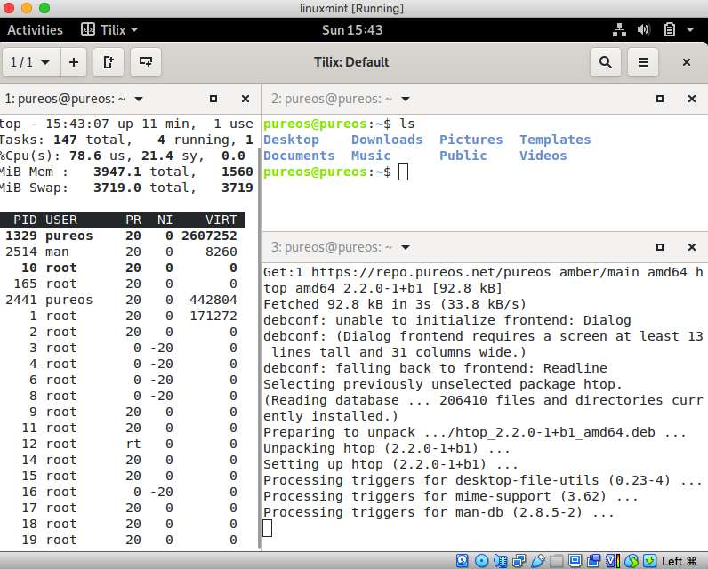

It provides [Tilix](https://gnunn1.github.io/tilix-web/) as its default terminal and this is the first time I am using the terminal, but it was hands down one of the best Linux terminals I have used so far. The most useful feature form me was the split panes vertically and horizontally feature and its white background which made the whole experience of using the terminal very sooting. And with the split panes I was able to do with Vi and terminal which I would do with a VSCode or another IDE. 

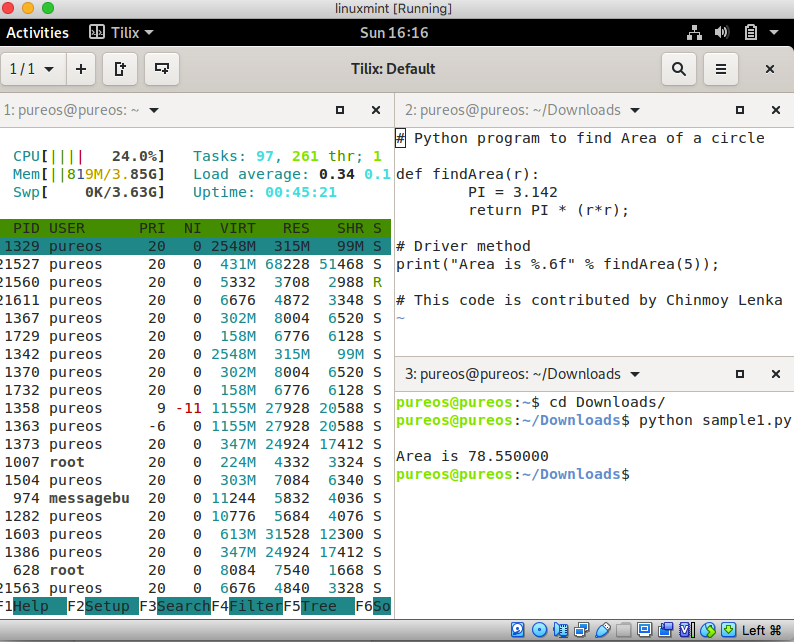

## Negatives

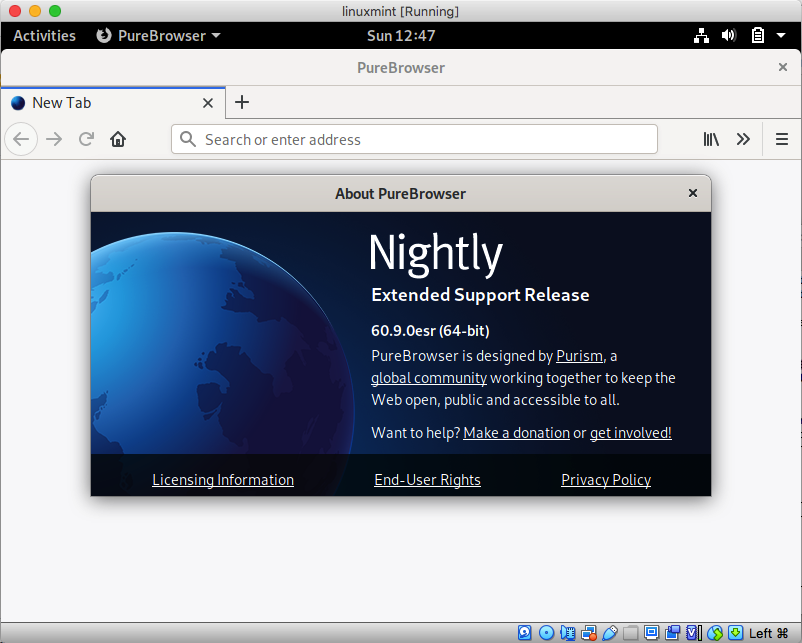

There were many things about the distro that I can not ignore, the most important of this being PureBrowser, to be honest I don't know what is different about PureBrowser than Firefox, for me it looked more of a rebadge than an original job. And the browser icon used for PureBrowser especially when this is the first thing you see on the PureOS website made me wonder why they did not put more effort. There are many good Linux distros who do a good job at developing their own browsers or even if they use Firefox they at least use good Icons. I know I am very much picky here but apart from security the look and feel of the icons is one area where it can improve.

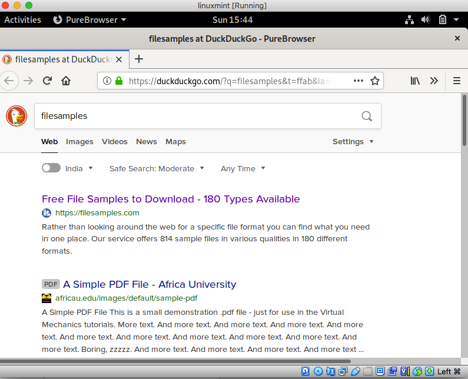

Another areas I was unimpressed was its multimedia support. The videos were laggy, the app used for images was not crisp and the music experience was just ok. Added to this that there was no direct customized help or welcome screen about PureOS, one wonders how will a new user get around using PureOS.

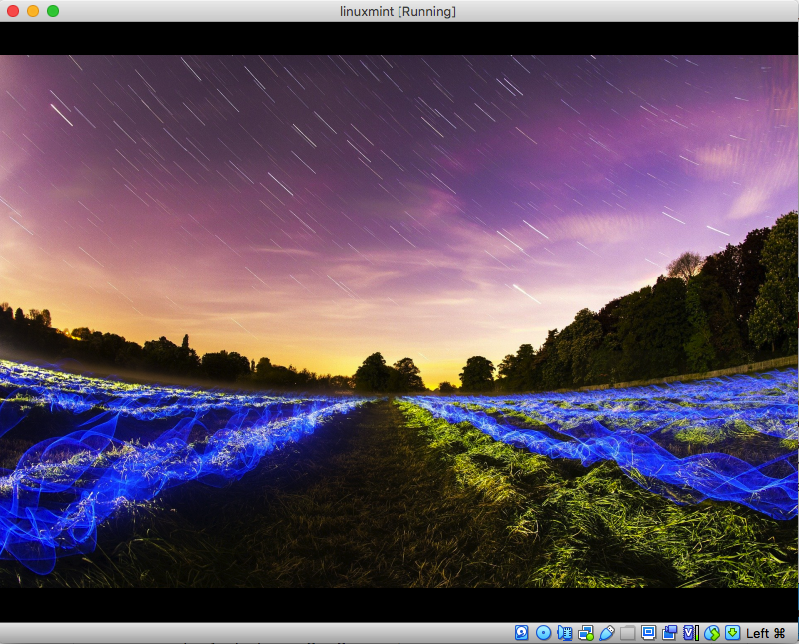

And given that it was from the testing branch of Debian as a rolling release, one can not expect a stable OS when planning to use it as a daily driver which takes out new Linux users out of the equation.

## Final Thoughts

Given that Purism is in the business of building hardware and PureOS is the operating system that powers its devices, I feel it should do more to make the usability and experience of PureOS better. Right now it is no match for Mac, Windows 10 or Chrome OS and even lags behind other Linux distributions like Elementary OS, Deepin and Solus.

